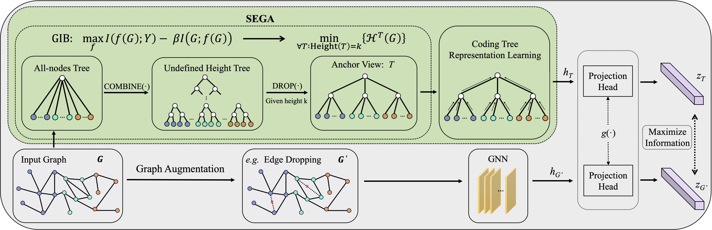

# SEGA: Structural Entropy Guided Anchor View for Graph Contrastive Learning

This code reproduces the experimental results obtained with the SEP layer as presented in the ICML 2023 paper:

[ICML](https://openreview.net/pdf?id=p32U4ulksI) 
[arXiv](https://arxiv.org/abs/2305.04501) 

Junran Wu<sup>\*</sup>, Xueyuan Chen<sup>\*</sup>, Bowen Shi, Shangzhe Li, Ke Xu

## Overview

In this paper, based on the theory of graph information bottleneck, we deduce the definition of the anchor view for graph contrastive learning; put differently, *the anchor view with essential information of input graph is supposed to have the minimal structural uncertainty*.

<p align="middle">

</p>

## Experiments

* Unsupervised learning [[TU Datasets]](https://github.com/Wu-Junran/SEGA/tree/master/unsupervised_TU)
* Transfer learning [[MoleculeNet and PPI]](https://github.com/Wu-Junran/SEGA/tree/master/transferLearning_MoleculeNet_PPI)
* Semi-supervised learning [[TU Datasets]](https://github.com/Wu-Junran/SEGA/tree/master/semisupervised_TU)


## Citation

If you found the provided code with our paper useful in your work, we kindly request that you cite our work. 

```
@inproceedings{wu2023sega,
  title={SEGA: Structural entropy guided anchor view for graph contrastive learning},
  author={Wu, Junran and Chen, Xueyuan and Shi, Bowen and Li, Shangzhe and Xu, Ke},
  booktitle={International Conference on Machine Learning},
  year={2023},
  organization={PMLR}
}
```

